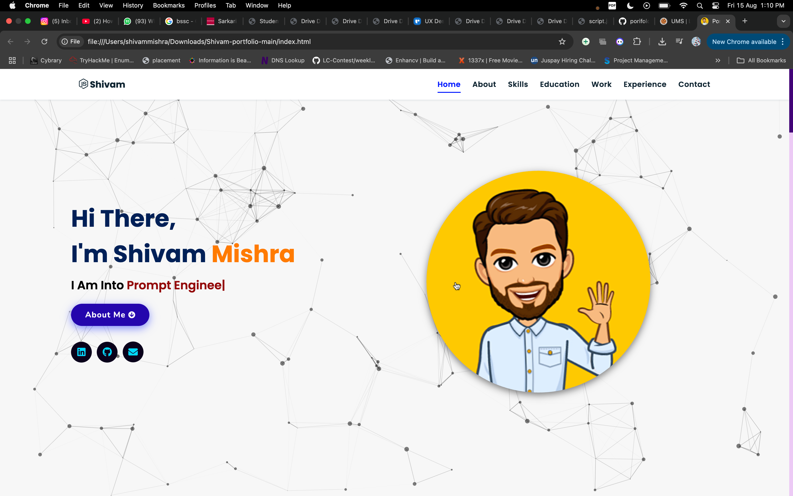
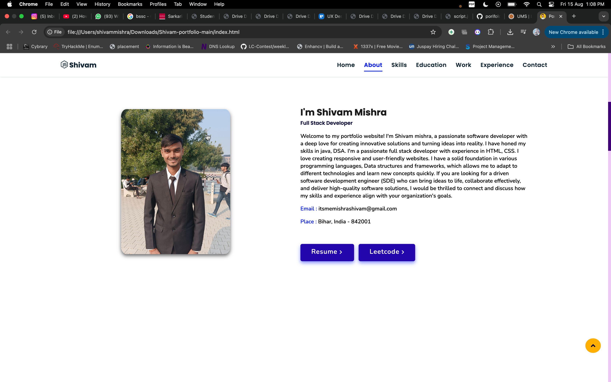

# Portfolio Website

This is Shivam Mishra's personal portfolio website, showcasing skills, projects, education, and professional experience.

## Live Demo

Check out the live demo [here](https://aryan-narayan.vercel.app/).

## 📌 Tech Stack

&nbsp;
&nbsp;
&nbsp;

---

### Screenshots:
#### Hero Section:

#### About Section:

---

## 📬 Contact

Feel free to reach me through the below handles if you'd like to contact me.

&nbsp;
&nbsp;

---

Thank you for visiting my portfolio website!
